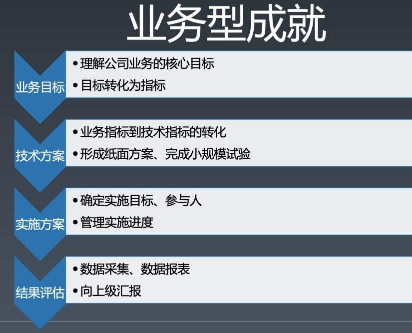
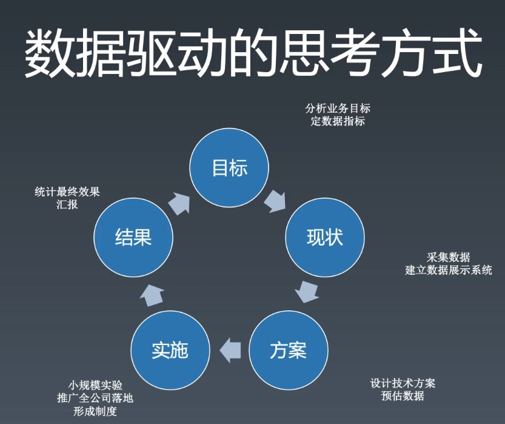

# 第一周总结

## 职业规划

You are the owner of your carieer

## 如何做业务

## 数据驱动的思考方式

# 学习方法

1. 整理法
2. 追溯法

## 前端技能模型

### 三大能力

1.  编程能力
2.  架构能力
3.  工程能力

## 深入参与开源项目读源码的方式

1. 帮写文档
2. fix bug
3. 单步追踪
4. 提交作者 review

# 前端知识体系总结

## HTML

### html as 计算机语言

- 词法
- 语法

### html as SGML

- DTD
- Entity

### html as XML

- Namespace

      	- svg
      	- mathml
      	- aria

- tag

      	- html
      	- head
      	- title
      	- base
      	- link
      	- meta
      	- style
      	- body
      	- article
      	- section
      	- nav
      	- aside
      	- h1
      	- h2
      	- h3
      	- h4
      	- h5
      	- h6
      	- hgroup
      	- header
      	- footer
      	- address
      	- p
      	- hr
      	- pre
      	- blockquote
      	- ol
      	- ul
      	- menu
      	- li
      	- dl
      	- dt
      	- dd
      	- figure
      	- figcaption
      	- main
      	- div
      	- a
      	- em
      	- strong
      	- small
      	- s
      	- cite
      	- q
      	- dfn
      	- abbr
      	- ruby
      	- rt
      	- rp
      	- data
      	- time
      	- code
      	- var
      	- samp
      	- kbd
      	- sub
      	- sup
      	- i
      	- b
      	- u
      	- mark
      	- bdi
      	- bdo
      	- span
      	- br
      	- wbr
      	- area
      	- ins
      	- del
      	- picture
      	- source
      	- img
      	- iframe
      	- embed
      	- object
      	- param
      	- video
      	- audio
      	- track
      	- map
      	- table
      	- caption
      	- colgroup
      	- col
      	- tbody
      	- thead
      	- tfoot
      	- tr
      	- td
      	- th
      	- form
      	- label
      	- input
      	- button
      	- select
      	- datalist
      	- optgroup
      	- option
      	- textarea
      	- output
      	- progress
      	- meter
      	- fieldset
      	- legend
      	- details
      	- summary
      	- dialog
      	- script
      	- noscript
      	- template
      	- slot
      	- canvas

## Javascript

### Grammer

- 词法

      	- WhiteSpace
      	- LineTerminator
      	- Comment
      	- token

      		- Identifier
      		- Keywords
      		- Punctuator
      		- NumbericLiteral
      		- StringLiteral
      		- RegularExpressionLiteral
      		- Template

- 语法

      	- Atom
      	- Expression
      	- Structure
      	- Scirpt & module

### 语义

### 运行时

- Type

      	- Number
      	- String
      	- Boolean
      	- Null
      	- Undefined
      	- Symbol
      	- Object
      	- 内部类型

      		- Reference
      		- Completion Record
      		- ...

- 执行过程

      	- Job
      	- Script／Module
      	- Promise
      	- Function
      	- Statement
      	- Expression
      	- Iiteral
      	- identifer

## Css

### 词法

### 语法

### @规则

### 普通规则

- 选择器

      	- 简单选择器

      		- .cls
      		- tag
      		- #id
      		- *
      		- [attr=v]

      	- 复合选择器 .cls#id
      	- 复杂选择器( )
      	- 选择器列表(,)

- property
- value

### 机制

- 排版
- 伪元素
- 动画

## API

### Browser

- DOM

      	- Nodes
      	- Ranges
      	- Events

### Node

### Electron

### 小程序

_XMind - Trial Version_
